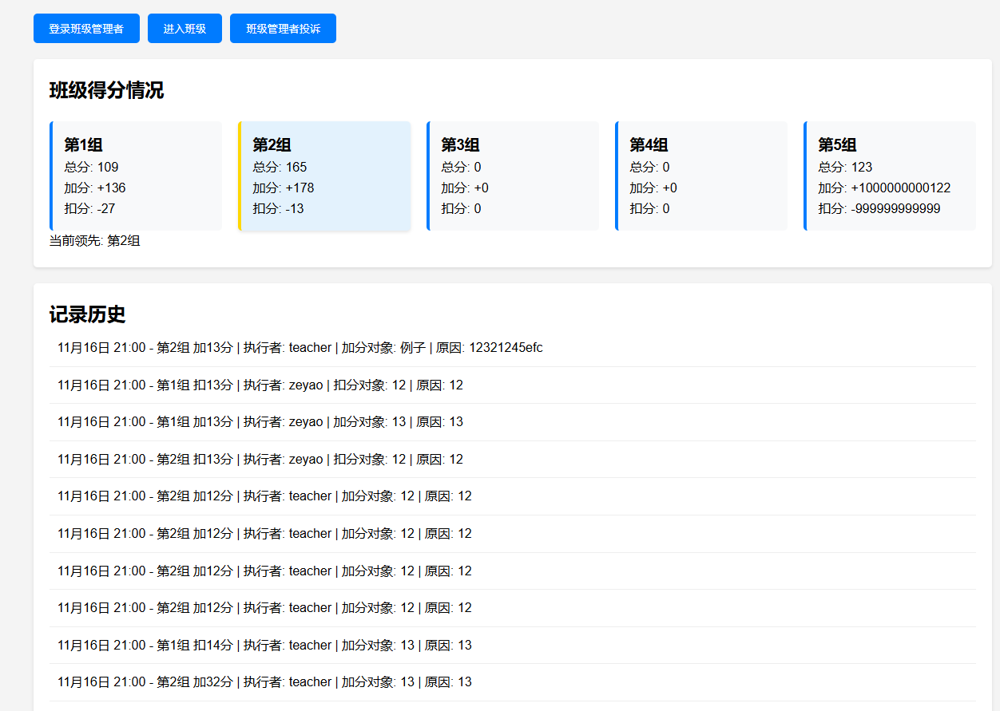

## 轻量化解决方案

## 中文版

### 项目说明
此程序为小组计分制管理系统，适用于学校或团队项目的计分管理。系统提供了简单的管理员密码管理以及班级口令存储功能。请注意，保存的信息并不安全，因此不建议在高安全性场景中使用。

### 使用说明

#### `code.txt`
- `code.txt` 文件用于存储管理员的密码。
- **重要提示：** 请注意保存的信息并不安全，密码可能以明文形式存储，请务必避免在高安全性环境下使用本程序。

#### `cipher.txt`
- `cipher.txt` 文件用于存储进入班级的口令（密码），用于限制访问权限。

#### `clearlog.py`
- `clearlog.py` 是一个独立程序，负责每周一清零的操作。您可以选择不运行它。通常情况下，直接运行 `app.py` 即可。

### 注意
- 本程序仅适用于学校或非商业用途，不保证其安全性，切勿在需要高度安全保护的场合使用。
- **目前仅提供中文简体版**，其他语言版本正在开发中。
- 这个是坨屎
- 再次声明这个是坨屎
- 依托狗屎
- 狗屎
- 狗都不用
- 难用的要死
- 大家千万别用

---

## English Version

### Project Description
This program is a group scoring management system, suitable for use in schools or team projects. The system provides simple administrator password management and stores class entry passwords. Please note that the stored information is not secure and should not be used in high-security environments.

### Usage Instructions

#### `code.txt`
- The `code.txt` file is used to store the administrator's password.
- **Important Notice:** Please be aware that the stored information is not secure, and passwords may be stored in plain text. Do not use this program in high-security environments.

#### `cipher.txt`
- The `cipher.txt` file stores the password for accessing the class, which is used to restrict access.

#### `clearlog.py`
- `clearlog.py` is a standalone script responsible for resetting the logs every Monday. You can choose not to run it. Generally, running `app.py` is sufficient.

### Note
- This program is only for use in schools or non-commercial purposes. It does not guarantee security, and it should not be used in situations requiring high levels of security.
- **Currently, only the Simplified Chinese version is available**. Other language versions are under development.

---

## 日本語版

### プロジェクトの説明
このプログラムは、学校やチームプロジェクトに適したグループスコアリング管理システムです。システムは、管理者パスワード管理とクラスのパスワード保存機能を提供します。ただし、保存される情報は安全ではないため、高セキュリティ環境での使用は避けてください。

### 使用方法

#### `code.txt`
- `code.txt` ファイルは、管理者のパスワードを保存するために使用されます。
- **重要な注意:** 保存される情報は安全ではないことにご注意ください。パスワードはプレーンテキストで保存される可能性があり、高セキュリティ環境では使用しないでください。

#### `cipher.txt`
- `cipher.txt` ファイルは、クラスにアクセスするためのパスワードを保存します。これにより、アクセスを制限することができます。

#### `clearlog.py`
- `clearlog.py` は独立したプログラムで、毎週月曜日にログをリセットする役割を果たします。実行しなくても構いません。通常は `app.py` を実行するだけで十分です。

### ご注意
- このプログラムは学校や非商業目的にのみ使用されることを想定しています。セキュリティは保証されていないため、高度なセキュリティを必要とする状況では使用しないでください。
- **現在、簡体字中国語版のみ提供しています**。他の言語版は開発中です。

